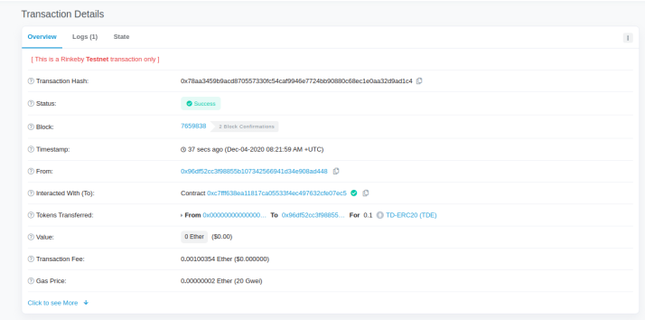
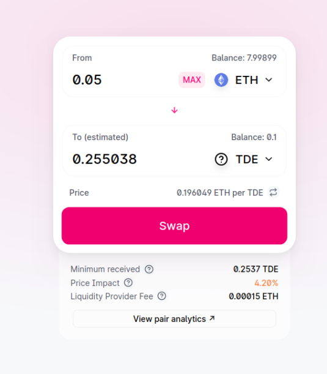
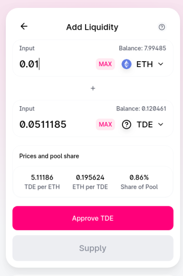
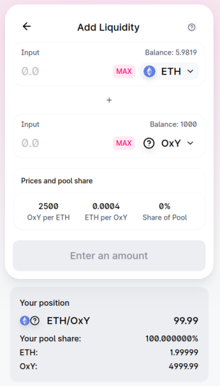

# UNISWAP implementation on rinkeby
 

## What have done :
1) Create a truffle project and configure it with infura 
2) Import Uniswap and Open Zeppelin libraries 
3) Claim tokens from token *0xc7FfF638Ea11817CA05533F4Ec497632cfE07eC5* manually

txID: *0x78aa3459b9acd870557330fc54caf9946e7724bb90880c68ec1e0aa32d9ad1c4*
   
   

4) Buy token *0xc7FfF638Ea11817CA05533F4Ec497632cfE07eC5* on Uniswap

txID: *0x11f7bcdea5155f19fbac80160511536a951316e3ee6c48716ddf4a12eefca897*
    

5) Provide liquidity to token *0xc7FfF638Ea11817CA05533F4Ec497632cfE07eC5*

txID: *0x37b002aa07cfc457d0b926c4ed25dcc5f885f59db60a751d734cce7f0c69ca4d*
    

6) Deploy an ERC20 Token (0xYYYY)  
txID: *0x3b7bd68209f3fcb0b2d14a7a6a1bdb1f72fec75f4400ba6a8ab4394a71dbc937*

Contract address: *0xeE528BFfb58B26d0953e06DcA0E2D8961Ddc2Dd4*

Code is at: ./contracts/OxYYYY.sol

7) Create a liquidity pool for your token 0xYYYY

txID: *0x1516574d91a64b9f2343733e3dbc3bf5840c4a0be95ea7da166560a6775fa65b*

8) Create a contract (0xZZZZ) that can hold your token 0xYYYY and deposit it in the Uniswap pool 
&
Enable your contract 0xZZZZ to withdraw liquidity from Uniswap and return token 0xYYYY to your address
&
Make it so that anyone can deposit Token 0xYYYY in your contract 0xZZZZ , supply liquidity to Uniswap, then withdraw it (keep track of balances)

Code is at: ./contracts.OxZZZZ.sol

txID: *0x2583046ec9faebc402ee45ea9e74ad69296128529fc5b62644d10a5d58ddfaa2*

Contract address: *0xee9ee12A337B423112905eBfa0dA97e3A453217e*